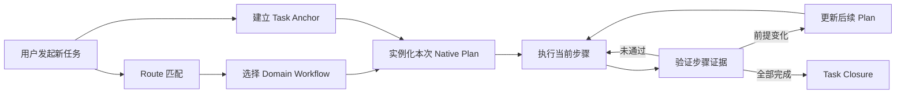

# Task Anchor：让 Agent 在 Session 内围绕目标持续执行

## 一句话介绍

Task Anchor 是 skill-based architecture 中面向任务执行的一层轻量协议：每当 Session 中开始一个新的非简单任务，Agent 先明确本次任务的目标和完成标准，再使用当前工具原生的 Plan 能力拆解、推进和验证步骤，从而避免执行过程中偏离用户最初的目标。

它仍然属于 Skill 的行为约定，不是新的任务管理系统，也不替代项目已有的 Workflow。

---

## 为什么需要 Task Anchor

skill-based architecture 已经解决了两个重要问题：

1. 通过路由找到当前任务应该读取的规则和 Workflow。
2. 通过 Task Closure 判断任务是否真正完成，并把有价值的经验回流到 Skill。

但在两者之间还存在一个容易被忽略的问题：

> Agent 虽然命中了正确的 Workflow，却可能在多轮调查、修改和验证中逐渐偏离用户本次真正想完成的目标。

常见表现包括：

- 调查过程中发现邻近问题，于是顺手扩大修改范围。
- 完成了很多步骤，却没有满足用户最初的完成标准。
- 用户在同一个 Session 中切换到新任务，Agent 仍沿用上一任务的上下文和计划。
- 计划只列出要做什么，却没有说明什么证据代表步骤已经完成。
- 新证据推翻原假设后，Agent 继续执行已经过期的计划。

Task Anchor 的作用，就是在任务开始时建立一个稳定的目标锚点，并让后续计划、步骤和验证始终围绕它展开。

---

## 核心模型

Task Anchor 由三个核心部分组成：

```text
Goal
本次任务最终要得到什么结果？

Boundaries（按需）
哪些内容属于范围，哪些内容不能做？

Done When
看到什么证据才算真正完成？
```

例如：

```text
目标
修复发布页面首次打开时状态不刷新的根因。

范围限制
- 不修改后端接口
- 不增加手动刷新按钮
- 保留工作区中与本任务无关的修改

完成标准
- 首次打开页面时自动显示正确状态
- 切换目标后自动刷新状态
- 相关测试通过
```

Goal 在任务执行期间应当相对稳定；Plan 可以根据新证据调整，但不能在没有说明的情况下偷偷改变 Goal。

这三个字段定义的是 Agent 在当前 Session 中必须维护的任务状态，不等于每次都要把同一套标签原样贴进对话。Task Anchor 是否建立，与它如何对用户展示，是两个独立问题。

---

## Task Anchor、Native Plan、Workflow 与 Closure

这四个概念分别解决不同问题：

| 概念 | 回答的问题 | 生命周期 |
|---|---|---|
| Task Anchor | 这次任务到底要实现什么 | 当前任务 |
| Native Plan | 这次任务按什么步骤推进、当前做到哪里 | 当前任务 |
| Domain Workflow | 这类任务通常应该怎样做、有哪些强制检查 | 长期 Skill 知识 |
| Task Closure | 当前任务是否满足目标、验证和知识回流要求 | 当前任务结束时 |

整体关系如下：



可以把 Workflow 和 Native Plan 理解为“模板”和“实例”的关系：

```text
Workflow = 某类任务的长期执行模板
Native Plan = Workflow 针对本次具体任务生成的执行实例
```

例如，`fix-bug` Workflow 可能规定：

```text
确认预期行为
→ 复现问题
→ 定位根因
→ 实现最小修复
→ 回归验证
→ Task Closure
```

针对一次具体问题，用户看到的 Native Plan 可以是：

```text
1. 复现首次打开时的状态异常
2. 跟踪初始化和请求时序
3. 修复查询条件初始化顺序
4. 运行相关测试
5. 验证首次打开和切换目标两条页面路径
```

Native Plan 不需要逐字复制 Workflow，但不能跳过 Workflow 中的强制门。例如，计划写得再短，也不能绕过 Bug 修复中的根因确认和回归验证。

---

## 面向用户的任务分级

Task Anchor 不应该给简单任务增加仪式成本。Agent 根据任务是否容易跑偏，选择不同执行方式：

| 任务类型 | 典型信号 | 用户体验 |
|---|---|---|
| Simple | 一个明确动作、一个直接检查、几乎没有跑偏空间 | 不展示 Task Anchor 和 Plan，直接执行 |
| Managed | 多个依赖步骤、明确限制、多轮验证或存在跑偏风险 | 建立 Task Anchor；默认自然语言对齐，按风险决定是否展示完整简报 |
| Design | 目标、方案或架构存在关键歧义，或涉及不可逆决策 | 先讨论并确认设计，再形成执行计划 |

不使用“调用了多少次工具”“修改了多少个文件”作为机械阈值。真正的判断标准是：

> 这个任务是否需要持续记住一个明确目标，才能避免执行过程中偏航？

---

## 用户看到什么：按任务风险渐进展示

Task Anchor 是运行时状态，不是固定的聊天模板。展示的目标是帮助用户确认方向，而不是向用户证明 Agent 已经执行了协议。

### 1. 普通 Managed 任务：自然语言对齐

默认使用一句自然语言覆盖结果、完成依据和真正重要的边界：

> 我会先定位首次加载链路，再做最小修复，最终以首次打开和切换目标都能自动显示正确状态、相关测试通过为完成标准；不修改后端接口。

不要求固定出现 `Goal / Done When / Boundaries / Plan` 标签。如果没有值得用户确认的新信息，也不必为了形式单独输出一个 Anchor 块。

### 2. 原生 Plan 已可见：不要在对话里重复步骤

Codex 等工具已经用原生 Plan / Task 视图展示步骤和当前状态时，对话只承担目标、验收和关键边界的对齐；步骤由原生界面承载。把同一组步骤再写进消息，会让 Task Anchor 看起来像突兀的内部协议，并制造两个可能漂移的 Plan 副本。

### 3. 复杂、长时间或范围敏感任务：展示完整任务简报

当任务复杂、持续时间长、边界敏感、需要用户确认，或当前工具没有可见的原生 Plan 时，完整结构反而能降低理解成本：

```text
执行目标
修复发布页面首次打开时状态不刷新的根因。

完成标准
- 首次打开和切换目标都能自动显示正确状态
- 相关测试通过

范围边界
- 不修改后端接口
- 不增加手动刷新按钮

执行步骤
1. 定位首次加载链路
2. 确认根因并实现最小修复
3. 运行针对性测试并验证页面行为
```

这里的完整简报借用了 file-based planning 的任务结构，但不引入持久化文件。不存在的边界或章节不展示，标题使用用户当前语言。

完成必要的对齐后默认直接执行，不要求用户为每个普通计划额外确认。只有以下情况暂停等待用户：

- 存在无法从代码、文档或运行状态推导的关键设计选择。
- 即将执行不可逆、共享或高影响操作。
- 需要扩大用户原本给出的范围。
- 触及明确的权限或人工确认边界。

执行过程中的状态更新应当围绕有意义的步骤变化，而不是持续输出工具调用流水账。

---

## Session 中的新任务边界

Task Anchor 服务于“当前任务”，而不是整个 Session。Session 中出现新消息时，Agent 需要先判断消息与当前目标的关系：

| 用户消息 | 处理方式 |
|---|---|
| 补充或修正当前需求 | 更新当前 Task Anchor 和剩余 Plan |
| 提出新的独立任务 | 重新匹配 Route，建立新的 Task Anchor，替换旧执行计划 |
| 询问当前进度 | 报告当前 Goal、当前步骤和已验证结果，不改变计划 |
| 要求暂停或停止 | 停止推进，不把未验证步骤标记为完成 |

这与现有的 Session Discipline 一致：每个新任务都要重新匹配 Route。Task Anchor 在路由之后进一步确保新任务不会继承上一任务已经过期的目标和计划。

---

## Recitation Loop：目标不是只在开场说一次

Task Anchor 的关键不是“展示过”，而是让目标在执行过程中反复回到当前注意力。每个主 Plan 步骤开始前，Agent 运行一次紧凑 Anchor Checkpoint：

```text
Goal
当前没有改变的可观察结果

Done When
还缺哪些目标级证据

Current Step
这一步要产出什么，用什么检查

Boundaries（仅相关项）
这一步不能越过什么边界
```

以下事件会再次触发 Checkpoint：用户补充或纠正需求；检查失败或证据推翻前提；Subagent 返回；任务被中断或上下文被压缩；即将扩大范围、执行共享 / 不可逆操作或进入 Closure。

Checkpoint 默认是 Agent 的内部执行动作。只有状态发生有意义的变化、Goal 需要改变或用户询问进度时才对外展示；不要在每次工具调用前重复播报。它依赖当前 Session 和 Native Plan，不创建 `task_plan.md`、`findings.md`、`progress.md`，也不承诺跨 Session 恢复。

如果 Agent 已无法从当前对话、命中 Route 和 Workflow 准确复述 Goal 或 Done When，应停止继续修改并先恢复任务语义；不能猜测缺失状态，也不能临时创建持久化系统作为兜底。

---

## 执行过程中的不变量

### 1. Goal 相对稳定，Plan 可以变化

调查发现原假设不成立时，应更新后续步骤；如果目标本身需要变化，则明确告诉用户，而不是静默改变任务含义。

### 2. 同一时间只有一个主步骤正在执行

原生 Plan 可以包含多个待办步骤，但主 Agent 应明确当前步骤。Subagent 可以并行执行独立工作流，但不能让主任务失去唯一的整合和决策焦点。

### 3. 验证证据推动状态前进

步骤不能因为“已经修改代码”“Subagent 说完成了”或“看起来应该可以”就标记完成。必须通过该步骤事先声明的检查。

### 4. 下一步必须直接服务于 Goal

进入下一步骤前，运行 Anchor Checkpoint，检查它是否仍然推动当前 Goal。邻近问题可以报告，但不能未经用户同意自动扩大任务范围。

### 5. 前提变化时先更新 Plan

当新证据改变根因、范围、顺序或完成标准时，先更新剩余计划，再继续修改。不要继续执行已过期的步骤。

### 6. Closure 对照 Task Anchor 验收

Task Closure 不只检查“步骤是否都做过”，还要重新核对 Goal、Boundaries 和 Done When。只有目标级完成标准成立，任务才算结束。

---

## 使用工具原生的 Plan 能力

Task Anchor 定义的是统一行为语义，不拥有自己的任务运行时。

在支持原生计划能力的工具中，应优先使用当前工具提供的 Plan 或 Task 能力维护步骤和状态。例如，在 Codex 中可以直接使用其原生计划模式。其他 Agent 使用各自等价的原生能力。

统一的是：

- 先确定 Goal 和 Done When。
- 多步骤任务形成计划。
- 明确当前步骤。
- 验证后才能推进。
- 前提变化时重规划。
- 最终通过 Task Closure 验收。

不要求统一的是：

- 不同工具的计划 UI。
- 状态存储格式。
- 工具内部的任务 API。
- Codex、Claude、Cursor 等工具之间的实时状态同步。

如果当前工具没有原生计划能力，可以降级为 Session 内的简短清单。Task Anchor 的状态生命周期止于当前 Session，不因此创建长期维护的计划文件。

---

## 明确的非目标

Task Anchor 不负责：

- 建设项目管理系统或任务数据库。
- 为每个简单任务生成计划。
- 创建固定的 `task_plan.md`、`findings.md`、`progress.md` 三文件结构。
- 在不同 Agent 工具之间同步实时任务状态。
- 替代 `fix-bug`、`change-managed`、`plan-feature` 等 Domain Workflow。
- 把某次任务的临时执行状态自动沉淀成长期 Skill 知识。

只有通过 Task Closure 和 AAR 筛选出的可复用结论，才进入长期规则、Workflow 或 Gotchas。

---

## 在 skill-based architecture 中的位置

引入 Task Anchor 后，整体任务路径从：

```text
New Task
→ Route
→ Domain Workflow
→ Task Closure
```

变为：

```text
New Task
→ Route
→ Task Anchor
→ Native Plan
→ Domain Workflow
→ Task Closure
```

各层职责保持单一：

- Route 选择任务类型。
- Task Anchor 固定当前目标和完成标准。
- Native Plan 管理本次执行步骤和状态。
- Domain Workflow 提供领域方法、强制门和检查要求。
- Task Closure 判断目标是否完成并处理知识回流。

Task Anchor 补齐的是“任务开始”和“任务执行中”的目标控制；它不改变 skill-based architecture 仍然是一个 Skill 的产品边界。

---

## 最终原则

Task Anchor 的价值可以归结为一句话：

> 让 Agent 在开始一个新任务时先明确自己要完成什么，并在每次推进、调整和结束时都能证明自己仍然围绕这个目标工作。
